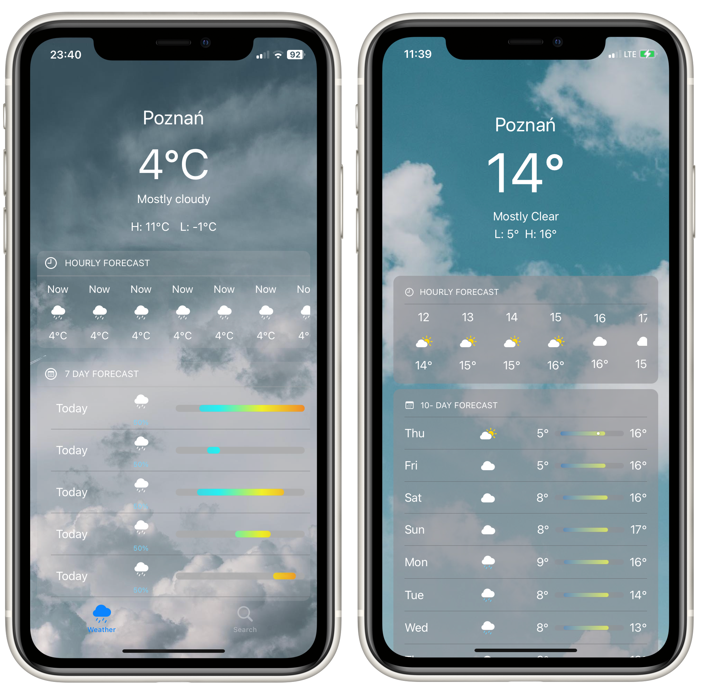

`# Storyboard-Weather-App

>WeatherKit brings valuable weather information to your apps and services through a wide range of data that can help people stay up to date, safe, and prepared. It’s easy to use WeatherKit in your apps for iOS 16, iPadOS 16, macOS 13, tvOS 16, and watchOS 9 with a platform-specific Swift API.\
Access to WeatherKit is included in the Apple Developer Program, which also provides all the tools, resources, and support you need to develop and distribute apps — including access to beta software, app services, testing tools, app analytics, and more.


 <h3>UI with Storyboard</h3>
  <p align="center">
  
</p>

<h3>UIKit vs SwiftUI</h3>
>Due to expired access to WeatherKit UIKit version displays dummy data.
>SwiftUI is also more polished
Check my [WeatherKitApp-SwiftUI] version of this App :)!

  <p align="center">
  
</p>


 <h3>Custom Temperature Bar View</h3>
  <p align="center">
  
  
  ```swift
@IBDesignable class TemperatureBarView: UIView {
    var view: UIView!
    var size: CGFloat = 0
    var position: CGFloat = 0
    
    override init(frame: CGRect) {
        super.init(frame: frame)
        loadViewFromNib()
    }
    
    required init?(coder: NSCoder){
        super.init(coder: coder)
        loadViewFromNib()
    }
    
    override func draw(_ rect: CGRect) {
        drawTemperatureBar(height: 10, inView: view)
    }
    
    override public func awakeFromNib() {
        super.awakeFromNib();
        self.backgroundColor = .clear
        view.backgroundColor = .clear
        size = CGFloat.random(in: 0...view.frame.width)
        position = CGFloat.random(in: 0...view.frame.width)
    }

    func loadViewFromNib(){
        let bundle = Bundle(for: type(of: self))
        let nib = UINib(nibName: String(describing: type(of: self)), bundle: bundle)
        let view = nib.instantiate(withOwner: self, options: nil).first as! UIView
        view.frame = bounds
        view.autoresizingMask = [
            UIView.AutoresizingMask.flexibleHeight,
            UIView.AutoresizingMask.flexibleWidth
        ]
        addSubview(view)
        self.view = view
    }
    
    func drawTemperatureBar(height: CGFloat, inView: UIView){
        let cornerRadius = 5.0
        let backgroundShape = CAShapeLayer()
        let backgroundFrame = CGRect(x: 0, y: 0, width: view.frame.width, height: height)
        let backgroundPath = UIBezierPath(roundedRect: backgroundFrame, cornerRadius: cornerRadius)
        
        backgroundShape.path = backgroundPath.cgPath
        backgroundShape.fillColor = UIColor.lightGray.cgColor
        
        let gradientLayer = CAGradientLayer()
        gradientLayer.startPoint = CGPoint(x: 0, y: 0)
        gradientLayer.endPoint = CGPoint(x: 1, y: 0)
        
        gradientLayer.frame = backgroundFrame
        gradientLayer.colors = [UIColor.systemTeal.cgColor, UIColor.cyan.cgColor, UIColor.yellow.cgColor, UIColor.orange.cgColor]
        gradientLayer.cornerRadius = cornerRadius
        
        let maskShape = CAShapeLayer()
        let maskFrame = CGRect(x: position, y: 0, width: size, height: height)
        let maskPath = UIBezierPath(roundedRect: maskFrame, cornerRadius: cornerRadius)
        
        maskShape.path = maskPath.cgPath
        gradientLayer.mask = maskShape
        
        backgroundShape.addSublayer(gradientLayer)
        backgroundShape.position = CGPoint(x: frame.minX, y: frame.midY - height / 2)
        backgroundShape.opacity = 0.4
        self.view.layer.addSublayer(backgroundShape)
    }
}
```
</p>

## Tech
  - UIKit
  - Core Location
  - WeatherKit
 
 [WeatherKitApp-SwiftUI]: <https://github.com/konifer44/WeatherKit-App-SwiftUI>
`
